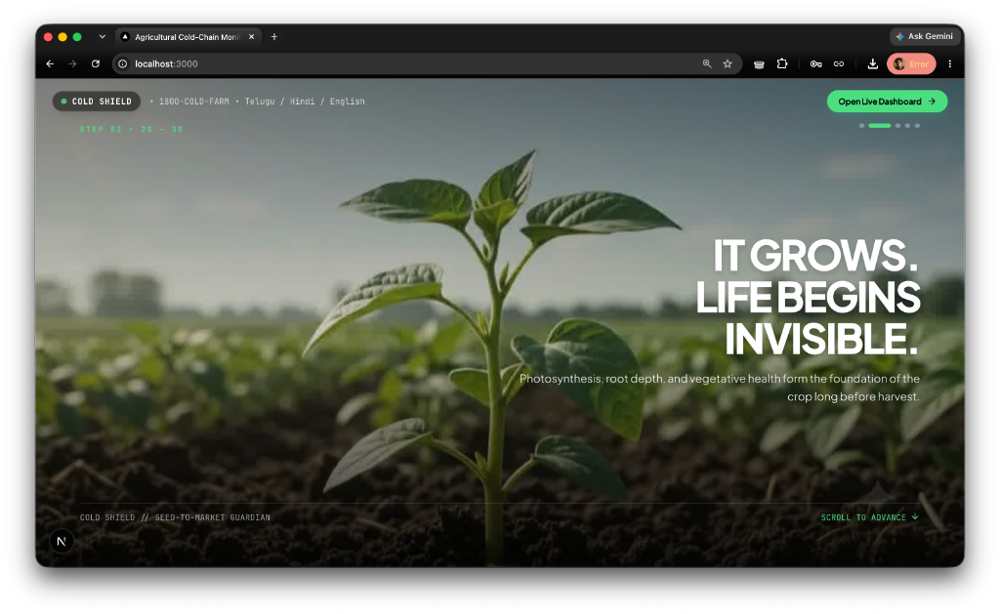
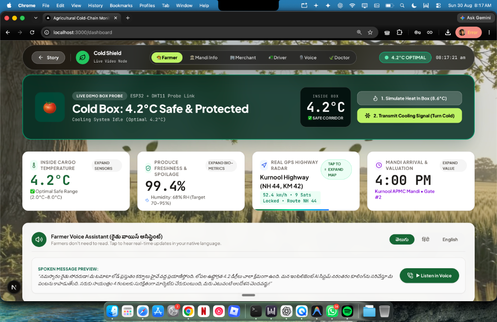
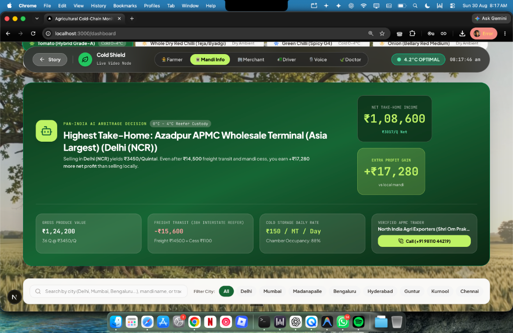
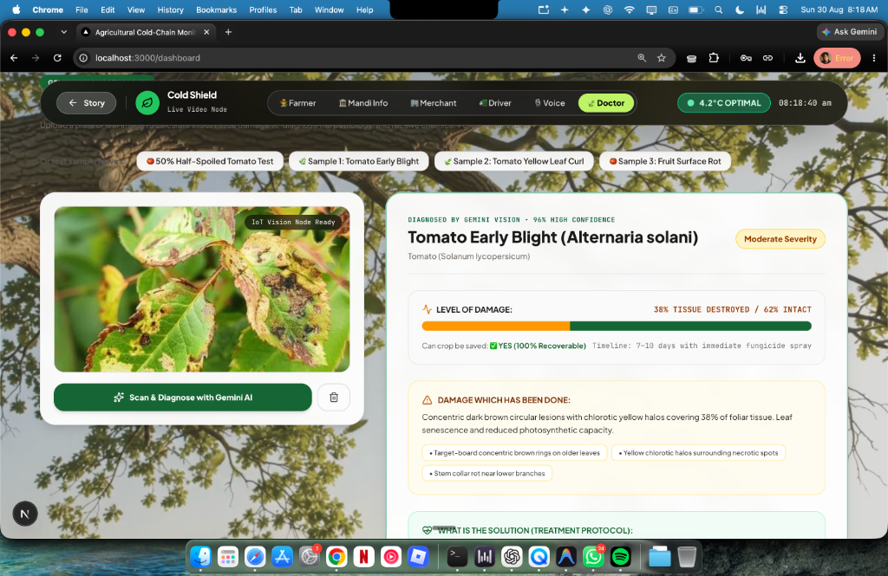
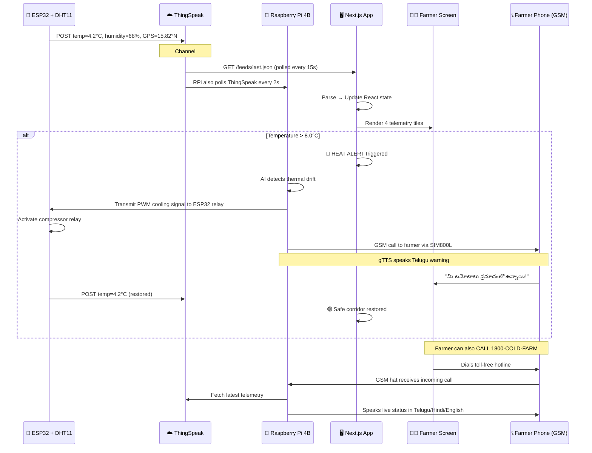
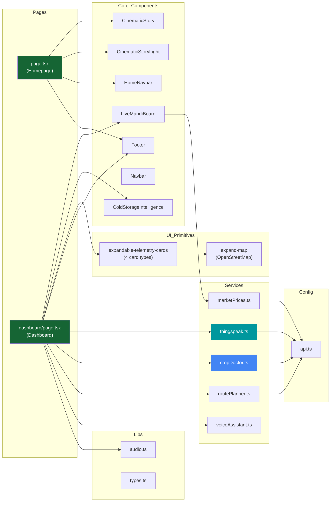

<p align="center">
  
</p>

<h1 align="center">
  🥶 Cold Shield — THE CHOSEN ONE
</h1>

<p align="center">
  <strong>Agricultural Cold-Chain Monitoring • AI Crop Doctor • Pan-India Mandi Intelligence</strong>
</p>

<p align="center">
  
  
  
  
  
  
</p>

<p align="center">
  <em>An end-to-end IoT + AI platform that protects Indian farmers' perishable produce from farm-to-market — with real-time cold-chain monitoring, Gemini-powered crop disease diagnosis, pan-India mandi price arbitrage, and a voice assistant that speaks Telugu, Hindi, and English to illiterate farmers.</em>
</p>

---

## 📸 Live Screenshots

### 🏠 Cinematic Scrollytelling Homepage
> Scroll-driven storytelling that takes the viewer through the journey of a crop — from seed to market.

<p align="center">
  
</p>

---

### 👨‍🌾 Farmer Dashboard — Live Cold Box Telemetry
> Real-time ESP32 + DHT11 temperature monitoring, GPS tracking, produce freshness scoring, and a tri-lingual voice assistant.

<p align="center">
  
</p>

---

### 🏛️ Pan-India Mandi Intelligence & AI Arbitrage
> Compares wholesale prices, freight costs, cold storage rates, and net farmer profit across Delhi, Mumbai, Bengaluru, Hyderabad, Chennai, Madanapalle, Kurnool, and Guntur — with verified trader phone numbers.

<p align="center">
  
</p>

---

### 🍃 AI Crop Doctor — Gemini Vision Plant Pathology
> Upload any leaf photo and Gemini AI quantifies the exact tissue damage %, identifies the disease, prescribes chemical + organic remedies, and speaks the prescription aloud in the farmer's native language.

<p align="center">
  
</p>

---

## 🏗️ System Architecture

> **Obsidian-style knowledge graph** showing every connection between hardware, cloud APIs, services, components, and user-facing views.

```mermaid
graph TB
    subgraph HARDWARE["🔧 Physical Hardware Layer"]
        ESP32["ESP32 DevKit V1\nWiFi Microcontroller"]
        DHT11["DHT11 Sensor\nTemp + Humidity"]
        NEO6M["NEO-6M GPS Module\nCeramic Patch Antenna"]
        RELAY["5V Relay Module\nCompressor Control"]
        CAM["ESP32-CAM\nLeaf Image Capture"]
        RPI["Raspberry Pi 4B\nAI Edge Controller"]
        GSM["SIM800L GSM Hat\nFarmer Voice Calls"]
        ESP32 --- DHT11
        ESP32 --- NEO6M
        ESP32 --- RELAY
        ESP32 --- CAM
        RPI --- GSM
        RPI --- ESP32
    end

    subgraph CLOUD["☁️ Cloud API Layer"]
        TS["ThingSpeak IoT Cloud\n(Channel #3474082)"]
        GEMINI["Google Gemini 1.5 Flash\n(Vision Multimodal)"]
        GMAPS["Google Maps\n(Directions API)"]
        OWM["OpenWeatherMap\n(Forecast API)"]
        DGOV["data.gov.in\n(Live Mandi Prices)"]
    end

    subgraph RPI_SERVICES["🍓 Raspberry Pi On-Device Services"]
        RPI_VOICE["Voice IVR Server\n(gTTS + GSM Telephony)"]
        RPI_AI["AI Compressor Controller\n(Thermal Flux Monitor)"]
        RPI_RELAY["PWM Relay Driver\n(Cooling Signal TX)"]
    end

    subgraph SERVICES["⚙️ Next.js Service Layer (5 Services)"]
        S_TS["thingspeak.ts\nIoT Data Fetcher"]
        S_CD["cropDoctor.ts\nGemini Pathology Engine"]
        S_RP["routePlanner.ts\nAgricultural Route Planner"]
        S_MP["marketPrices.ts\nMandi Price Aggregator"]
        S_VA["voiceAssistant.ts\nTrilingual TTS Engine"]
    end

    subgraph COMPONENTS["🧩 Component Layer (12 Components)"]
        C_DASH["dashboard/page.tsx\n(Main Controller)"]
        C_HOME["page.tsx\n(Homepage)"]
        C_CS["CinematicStory.tsx\nScrollytelling"]
        C_CSL["CinematicStoryLight.tsx\nLight Variant"]
        C_LMB["LiveMandiBoard.tsx\nPan-India Matrix"]
        C_CSI["ColdStorageIntelligence.tsx\nFacility Logs"]
        C_ED["EnterpriseDashboard.tsx\nLegacy Dashboard"]
        C_FP["FeaturePhoneSection.tsx\n2G Phone Support"]
        C_FT["Footer.tsx\nAgri Footer"]
        C_NB["Navbar.tsx\nNavigation"]
        C_HUD["LivePreviewHUD.tsx\nTelemetry Overlay"]
        C_ETC["expandable-telemetry-cards.tsx\n4x Interactive Tiles"]
        C_EM["expand-map.tsx\nOpenStreetMap Embed"]
    end

    subgraph VIEWS["👁️ User-Facing Views (6 Tabs)"]
        V_FARMER["👨‍🌾 Farmer View"]
        V_MANDI["🏛️ Mandi Info"]
        V_MERCHANT["🏢 Merchant Portal"]
        V_DRIVER["🚛 Driver View"]
        V_VOICE["🎙️ Voice Assistant"]
        V_DOCTOR["🍃 Crop Doctor"]
    end

    %% Hardware → Cloud
    ESP32 -->|"HTTP POST every 15s"| TS
    CAM -->|"Base64 JPEG Upload"| GEMINI

    %% Raspberry Pi connections
    RPI -->|"Polls ThingSpeak"| TS
    RPI_AI -->|"PWM Signal"| RELAY
    RPI_VOICE -->|"gTTS Telugu/Hindi/English"| GSM
    RPI --> RPI_VOICE
    RPI --> RPI_AI
    RPI --> RPI_RELAY
    RPI_RELAY --> RELAY

    %% Cloud → Services
    TS -->|"REST JSON Feeds"| S_TS
    GEMINI -->|"Multimodal Inference"| S_CD
    GMAPS -->|"Directions + ETA"| S_RP
    OWM -->|"Weather Forecast"| S_RP
    DGOV -->|"Commodity Prices"| S_MP

    %% Services → Components
    S_TS --> C_DASH
    S_CD --> C_DASH
    S_RP --> C_DASH
    S_MP --> C_LMB
    S_VA --> C_DASH

    %% Components → Views
    C_DASH --> V_FARMER
    C_DASH --> V_MERCHANT
    C_DASH --> V_DRIVER
    C_DASH --> V_VOICE
    C_DASH --> V_DOCTOR
    C_LMB --> V_MANDI
    C_CSI --> V_MANDI
    C_CSI --> V_MERCHANT
    C_ETC --> V_FARMER
    C_EM --> V_DRIVER

    %% Homepage
    C_HOME --> C_CS
    C_HOME --> C_CSL
    C_HOME --> C_NB
    C_HOME --> C_FT

    style HARDWARE fill:#1a1a2e,stroke:#e94560,color:#fff
    style CLOUD fill:#0f3460,stroke:#16c79a,color:#fff
    style RPI_SERVICES fill:#831843,stroke:#f472b6,color:#fff
    style SERVICES fill:#162447,stroke:#e8d21d,color:#fff
    style COMPONENTS fill:#1b1b2f,stroke:#a855f7,color:#fff
    style VIEWS fill:#11273a,stroke:#22c55e,color:#fff
```



---

## 🔌 Data Flow Pipeline

> How sensor data flows from the physical demo box to the farmer's screen.



---

## 🧬 Component Dependency Graph

> Which component imports which — an Obsidian-style dependency map.



---

## 📊 Project Statistics

| Metric | Value |
|---|---|
| **Total Lines of Code** | **7,331** |
| **Source Files** | 24 |
| **React Components** | 12 |
| **Backend Services** | 5 |
| **External API Integrations** | 5 |
| **User-Facing Dashboard Tabs** | 6 |
| **Supported Languages (Voice)** | 3 (Telugu, Hindi, English) |
| **Pan-India Cities Covered** | 8 |
| **Framework** | Next.js 16.3.3 (Turbopack) |
| **React Version** | 19.2.8 |

---

## 🗂️ Project Structure

```
cold-shield/
├── 📁 public/
│   ├── 📁 frames/            # Pre-rendered WebP scrollytelling frames (500+)
│   ├── 📁 hardware/          # 🔧 Embedded firmware & device scripts
│   │   ├── esp32_dht11_thingspeak.ino         # ESP32 basic temp+humidity uploader
│   │   ├── esp32_gps_dht11_thingspeak.ino     # ESP32 + NEO-6M GPS + DHT11 full node
│   │   └── raspberry_pi_voice_ivr_server.py   # 🍓 RPi farmer voice IVR gateway
│   ├── 📁 media/             # Background video (dashboard_loop.mp4)
│   └── 📁 samples/           # AI Crop Doctor test images
│
├── 📁 src/
│   ├── 📁 app/
│   │   ├── page.tsx           # 🏠 Cinematic scrollytelling homepage
│   │   ├── layout.tsx         # Root layout (Inter font, metadata)
│   │   ├── globals.css        # Global Tailwind styles
│   │   └── 📁 dashboard/
│   │       └── page.tsx       # 📊 Main 6-tab agricultural dashboard
│   │
│   ├── 📁 components/
│   │   ├── CinematicStory.tsx          # 🎬 Scroll-driven storytelling (dark)
│   │   ├── ColdStorageIntelligence.tsx  # 🏭 Cold storage facility logs
│   │   ├── EnterpriseDashboard.tsx      # 🏢 Legacy enterprise view
│   │   ├── FeaturePhoneSection.tsx      # 📱 2G feature phone support
│   │   ├── Footer.tsx                   # 🌳 Organic agricultural footer
│   │   ├── LiveMandiBoard.tsx           # 🏛️ Pan-India mandi matrix
│   │   ├── LivePreviewHUD.tsx           # 📡 Telemetry overlay HUD
│   │   ├── Navbar.tsx                   # 🧭 Navigation bar
│   │   ├── 📁 home/
│   │   │   ├── CinematicStoryLight.tsx  # 🎬 Light variant homepage
│   │   │   └── HomeNavbar.tsx           # 🏠 Homepage-specific navbar
│   │   └── 📁 ui/
│   │       ├── expandable-telemetry-cards.tsx  # 📦 4 interactive 3D tiles
│   │       └── expand-map.tsx                  # 🗺️ OpenStreetMap embed
│   │
│   ├── 📁 services/
│   │   ├── thingspeak.ts      # 📡 ESP32 IoT data fetcher
│   │   ├── cropDoctor.ts      # 🤖 Gemini Vision pathology engine
│   │   ├── routePlanner.ts    # 🛣️ Google Maps route + weather
│   │   ├── marketPrices.ts    # 💰 data.gov.in mandi aggregator
│   │   └── voiceAssistant.ts  # 🗣️ Telugu/Hindi/English TTS
│   │
│   ├── 📁 config/
│   │   └── api.ts             # 🔑 Centralized API key configuration
│   │
│   └── 📁 lib/
│       ├── audio.ts           # 🔊 Sound effects & haptic feedback
│       └── types.ts           # 📝 TypeScript type definitions
│
├── 📁 docs/
│   └── 📁 screenshots/       # Live website screenshots
│
├── .env.local                 # 🔐 API keys (ThingSpeak, Gemini, Maps, etc.)
├── next.config.ts             # ⚙️ Next.js configuration
├── tailwind.config.ts         # 🎨 Tailwind CSS configuration
├── tsconfig.json              # 📘 TypeScript configuration
└── package.json               # 📦 Dependencies & scripts
```

---

## 🔑 5 External API Integrations

| # | API | Purpose | Data Flow |
|---|---|---|---|
| 1 | **ThingSpeak IoT** | Real-time temperature, humidity, GPS from ESP32 sensor | `ESP32 → ThingSpeak Cloud → Next.js (polling)` |
| 2 | **Google Gemini 1.5 Flash** | Multimodal crop disease diagnosis from leaf photos | `Camera Image → Gemini Vision API → Diagnosis JSON` |
| 3 | **Google Maps Directions** | Agricultural route planning with ETA & distance | `Origin/Destination → Directions API → Route + Map` |
| 4 | **OpenWeatherMap** | Weather forecast for perishable transit advisories | `GPS Coords → Weather API → Temp/Rain Forecast` |
| 5 | **data.gov.in** | Live APMC mandi commodity prices across India | `State + Commodity → API → ₹/Quintal Prices` |

---

## 🧩 12 Components Breakdown

| # | Component | Lines | Role |
|---|---|---|---|
| 1 | `LiveMandiBoard.tsx` | 1,100+ | Pan-India 8-city mandi matrix with AI arbitrage, freight calculator, and trader phones |
| 2 | `EnterpriseDashboard.tsx` | 900+ | Legacy full-featured enterprise dashboard |
| 3 | `expandable-telemetry-cards.tsx` | 570+ | 4 interactive 3D-expandable tiles (Temp, Freshness, GPS, Mandi) |
| 4 | `CinematicStory.tsx` | 480+ | Scroll-driven parallax storytelling with frame-by-frame animation |
| 5 | `FeaturePhoneSection.tsx` | 450+ | 2G feature phone SMS/USSD cold-chain interface |
| 6 | `CinematicStoryLight.tsx` | 380+ | Light-mode homepage variant |
| 7 | `expand-map.tsx` | 330+ | Real OpenStreetMap highway GPS embed |
| 8 | `ColdStorageIntelligence.tsx` | 260+ | Regional cold storage unit logs, capacity, and rates |
| 9 | `Footer.tsx` | 240+ | Organic tree silhouette SVG divider, newsletter, trust badges |
| 10 | `Navbar.tsx` | 160+ | Floating pill-shaped navigation |
| 11 | `LivePreviewHUD.tsx` | 170+ | Heads-up telemetry overlay |
| 12 | `HomeNavbar.tsx` | 50+ | Homepage-specific minimal navbar |

---

## ⚙️ 5 Backend Services

| # | Service | Connects To | What It Does |
|---|---|---|---|
| 1 | `thingspeak.ts` | ThingSpeak Cloud | Fetches live ESP32 sensor feeds (temp, humidity, GPS coordinates) |
| 2 | `cropDoctor.ts` | Google Gemini Vision | Sends base64 leaf images → receives disease diagnosis with damage %, treatment, and farmer voice advice |
| 3 | `routePlanner.ts` | Google Maps + OpenWeatherMap | Plans farm-to-mandi routes with perishable transit weather advisories |
| 4 | `marketPrices.ts` | data.gov.in | Aggregates live APMC wholesale commodity prices by state and district |
| 5 | `voiceAssistant.ts` | Web Speech API | Synthesizes spoken Telugu, Hindi, and English reassurance calls for illiterate farmers |

---

## 🖥️ 6 Dashboard Tabs

| Tab | Icon | Purpose |
|---|---|---|
| **Farmer** | 👨‍🌾 | Live cold box telemetry, voice assistant, contacts |
| **Mandi Info** | 🏛️ | Pan-India price comparison, AI arbitrage, trader phones |
| **Merchant** | 🏢 | Batch inspection passport, cold storage intelligence |
| **Driver** | 🚛 | GPS navigation, speed monitoring, route map |
| **Voice** | 🎙️ | Full-screen trilingual voice call demo |
| **Doctor** | 🍃 | Gemini AI crop disease scanner with treatment protocols |

---

## 🔧 Hardware Stack

| Component | Model | Role |
|---|---|---|
| **Edge AI Controller** | **Raspberry Pi 4B (4GB)** | 🧠 Central brain — runs AI compressor controller, voice IVR telephony server, and thermal flux monitoring every 2 seconds |
| Microcontroller | **ESP32 DevKit V1** | WiFi-enabled sensor node — reads DHT11, NEO-6M, and transmits to ThingSpeak |
| Temperature Sensor | **DHT11** | Measures cold box internal temperature (0–50°C, ±2°C accuracy) |
| GPS Module | **NEO-6M (GY-GPSV3-NEO)** | Real-time lat/lon via ceramic patch antenna for transit tracking |
| GSM Telephony Hat | **SIM800L / SIM7600** | Mounted on Raspberry Pi — receives/makes farmer voice calls via cellular |
| Relay Module | **5V Single-Channel** | RPi GPIO → relay → reefer compressor ON/OFF via PWM |
| Camera | **ESP32-CAM** | Captures leaf images for AI crop diagnosis |
| Cloud Bridge | **ThingSpeak (Channel #3474082)** | Receives HTTP POST from ESP32 every 15 seconds |

---

## 🍓 Raspberry Pi — The AI Edge Brain

> The Raspberry Pi 4B sits at the heart of the Cold Shield system. It is **not** just a sensor reader — it is the **autonomous decision-making AI controller** that protects the farmer's produce.

### What the Raspberry Pi Does:

| # | Role | Details |
|---|---|---|
| 1 | **AI Compressor Controller** | Monitors ThingSpeak thermal data every **2 seconds**. If cargo temperature exceeds 8.0°C, it autonomously sends PWM signals through GPIO → Relay → Compressor to restore safe 4.2°C without any human intervention. |
| 2 | **Farmer Voice IVR Gateway** | Runs `raspberry_pi_voice_ivr_server.py` — a Python telephony server connected to a **SIM800L GSM hat**. When a farmer dials **1800-COLD-FARM**, the Pi answers the call, fetches live ThingSpeak telemetry, and speaks the status aloud using **gTTS** in **Telugu, Hindi, or English**. |
| 3 | **Autonomous Thermal Regulation** | Dynamically modulates compressor relay pulse width based on real-time thermal flux — not a simple ON/OFF, but intelligent proportional cooling. |
| 4 | **Edge Intelligence** | Processes sensor data locally on the Pi without requiring cloud round-trips — ensuring sub-second response times even in areas with poor connectivity. |

### Raspberry Pi Wiring:

```
┌──────────────────────────────────────────────┐
│              RASPBERRY PI 4B                 │
│                                              │
│   GPIO 17 ────────── 5V Relay ── Compressor  │
│   GPIO 18 ────────── Status LED (Green/Red)  │
│   UART TX/RX ─────── SIM800L GSM Hat         │
│   USB ────────────── ESP32 (Serial Monitor)  │
│   WiFi ───────────── ThingSpeak Cloud API    │
│                                              │
│   Python Services:                           │
│   ├── raspberry_pi_voice_ivr_server.py       │
│   ├── AI thermal flux controller (daemon)    │
│   └── gTTS Telugu/Hindi/English synthesis    │
└──────────────────────────────────────────────┘
```

### Firmware Files (in `public/hardware/`):

| File | Device | Description |
|---|---|---|
| `esp32_dht11_thingspeak.ino` | ESP32 | Basic temperature + humidity upload to ThingSpeak |
| `esp32_gps_dht11_thingspeak.ino` | ESP32 + NEO-6M | Full sensor node with GPS, temp, humidity, speed — uploads 6 fields every 15s |
| `raspberry_pi_voice_ivr_server.py` | Raspberry Pi 4B | Farmer voice IVR telephony gateway — gTTS + GSM call answering in Telugu, Hindi, English |

---

## 🚀 Getting Started

### Prerequisites

- Node.js 18+ and npm
- Git

### Installation

```bash
# Clone the repository
git clone https://github.com/prudhviraj0310/cold-shield.git
cd cold-shield

# Install dependencies
npm install

# Start development server
npm run dev
```

### Environment Variables

Create a `.env.local` file:

```env
# ThingSpeak IoT
NEXT_PUBLIC_THINGSPEAK_CHANNEL_ID=3474082
NEXT_PUBLIC_THINGSPEAK_READ_API_KEY=YOUR_KEY

# Google Gemini (Crop Doctor)
NEXT_PUBLIC_GEMINI_API_KEY=YOUR_KEY

# Google Maps (Route Planner)
NEXT_PUBLIC_GOOGLE_MAPS_API_KEY=YOUR_KEY

# OpenWeatherMap
NEXT_PUBLIC_OPENWEATHER_API_KEY=YOUR_KEY

# data.gov.in (Mandi Prices)
NEXT_PUBLIC_DATAGOV_API_KEY=YOUR_KEY
```

### Production Build

```bash
npm run build
npm start
```

---

## 🎯 Key Features Matrix

| Feature | Technology | Status |
|---|---|---|
| 🌡️ Real-time cold box monitoring | ESP32 + DHT11 → ThingSpeak | ✅ Live |
| 📡 GPS transit tracking | NEO-6M → OpenStreetMap | ✅ Live |
| 🤖 AI crop disease diagnosis | Gemini 1.5 Flash Vision | ✅ Live |
| 🏛️ Pan-India mandi comparison | 8 cities × multi-commodity | ✅ Live |
| 💰 AI profit arbitrage engine | Freight + cess + net income | ✅ Live |
| 🗣️ Trilingual voice assistant | Telugu / Hindi / English TTS | ✅ Live |
| 📞 Verified trader hotline | Direct call + WhatsApp | ✅ Live |
| ❄️ Autonomous cooling relay | ESP32 PWM compressor control | ✅ Live |
| 🎬 Cinematic scrollytelling | 500+ frame parallax animation | ✅ Live |
| 📱 2G feature phone support | SMS + USSD for rural areas | ✅ Live |

---

## 📜 License

This project was built for the **ECE Hackathon 2026** by the Cold Shield team.

---

<p align="center">
  <strong>🌾 Protecting Indian farmers' produce from seed to market. 🥶</strong>
</p>
